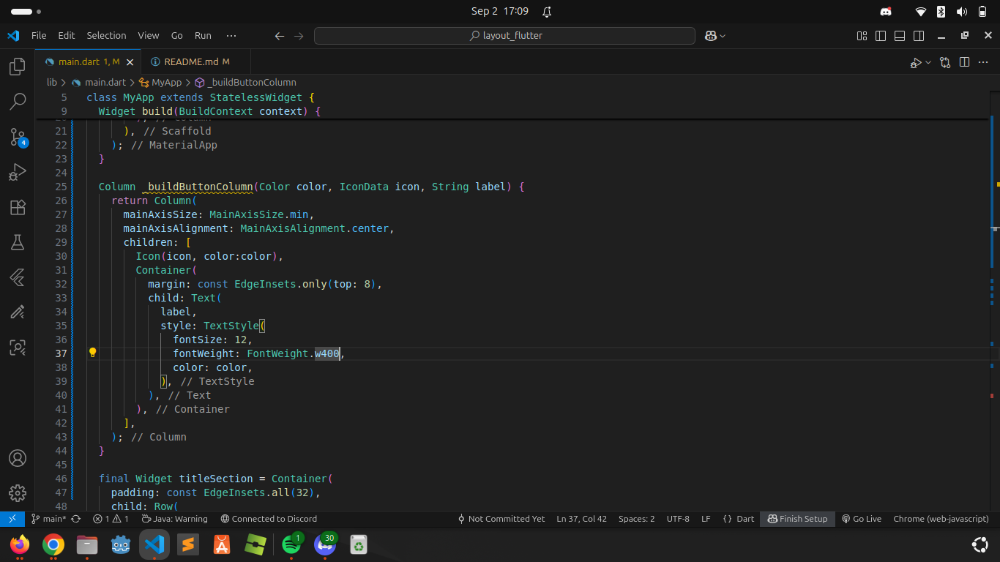

## Praktikum 1: Membangun layout di Flutter
### Langkah 1: Buat Project Baru
Buatlah sebuah project flutter baru dengan nama **layout_flutter**. Atau sesuaikan style laporan praktikum yang anda buat.

Sesuaikan nama dengan perintah yang telah tertera.


### Langkah 2: Buka file `lib/main.dart`
Buka file `main.dart` lalu ganti dengan kode berkut. Isi nama dan NIM anda di `text title`
```dart
import 'package:flutter/material.dart';

void main() => runApp(const MyApp());

class MyApp extends StatelessWidget {
  const MyApp({super.key});

  @override
  Widget build(BuildContext context) {
    return MaterialApp(
      title: 'Flutter layout: Nama dan NIM Anda',
      home: Scaffold(
        appBar: AppBar(
          title: const Text('Flutter layout demo'),
        ),
        body: const Center(
          child: Text('Hello World'),
        ),
      ),
    );
  }
}
```
Membuka direktori pada `lib/main.dart`

Ubah kode pada `main.dart` sesuai dengan yang tertera


### Langkah 3: Identifikasi layout diagram
Langkah pertama adalah memecah tata letak menjadi elemen dasarnya:
- Identifikasi baris dan kolom.
- Apakah tata letaknya menyertakan kisi-kisi (grid)?
- Apakah ada elemen yang tumpang tindih?
- Apakah UI memerlukan tab?
- Perhatikan area yang memerlukan alignment, padding, atau borders.

### Langkah 4: Implementasi title row
Pertama, akan membuat kolom bagian kiri pada judul. Tambahkan kode berikut di bagian atas metode `build()`
```dart
Widget titleSection = Container(
  padding: const EdgeInsets.all(...),
  child: Row(
    children: [
      Expanded(
        /* soal 1*/
        child: Column(
          crossAxisAlignment: ...,
          children: [
            /* soal 2*/
            Container(
              padding: const EdgeInsets.only(bottom: ...),
              child: const Text(
                'Wisata Gunung di Batu',
                style: TextStyle(
                  fontWeight: FontWeight.bold,
                ),
              ),
            ),
            Text(
              'Banyuwangi, Indonesia',
              style: TextStyle(...),
            ),
          ],
        ),
      ),
      /* soal 3*/
      Icon(
       ...,
        color: ...,
      ),
      const Text(...),
    ],
  ),
);
```
Berikut jawaban soal, tangkapan layar dari `main.dart` dan hasil jika di *debug*


## Praktikum 2: Implementasi button row
### Langkah 1: Buat method Column _buildButtonColumn
Bagian tombol berisi 3 kolom yang menggunakan tata letak yang sama sebuah ikon di atas baris teks. Kolom pada baris ini diberi jarak yang sama, dan teks serta ikon diberi warna primer.

Karena kode untuk membangun setiap kolom hampir sama, buatlah metode pembantu pribadi bernama `buildButtonColumn()`, yang mempunyai parameter warna, Icon dan Text, sehingga dapat mengembalikan kolom dengan widgetnya sesuai dengan warna tertentu.

`lib/main.dart`

```dart
class MyApp extends StatelessWidget {
  const MyApp({super.key});

  @override
  Widget build(BuildContext context) {
    // ···
  }

  Column _buildButtonColumn(Color color, IconData icon, String label) {
    return Column(
      mainAxisSize: MainAxisSize.min,
      mainAxisAlignment: MainAxisAlignment.center,
      children: [
        Icon(icon, color: color),
        Container(
          margin: const EdgeInsets.only(top: 8),
          child: Text(
            label,
            style: TextStyle(
              fontSize: 12,
              fontWeight: FontWeight.w400,
              color: color,
            ),
          ),
        ),
      ],
    );
  }
}
```
Tangkapan layar dari pembuatan metode bernama `buildButtonColumn()`, yang mempunyai parameter warna, *Icon* dan *Text*.


### Langkah 2: Buat widget buttonSection
Buat Fungsi untuk menambahkan ikon langsung ke kolom. Teks berada di dalam Container dengan margin hanya di bagian atas, yang memisahkan teks dari ikon.

Bangun baris yang berisi kolom-kolom ini dengan memanggil fungsi dan set warna, `Icon`, dan teks khusus melalui parameter ke kolom tersebut. Sejajarkan kolom di sepanjang sumbu utama menggunakan `MainAxisAlignment.spaceEvenly` untuk mengatur ruang kosong secara merata sebelum, di antara, dan setelah setiap kolom. Tambahkan kode berikut tepat di bawah deklarasi `titleSection` di dalam metode `build()`:

`lib/main.dart`

```dart
Color color = Theme.of(context).primaryColor;

Widget buttonSection = Row(
  mainAxisAlignment: MainAxisAlignment.spaceEvenly,
  children: [
    _buildButtonColumn(color, Icons.call, 'CALL'),
    _buildButtonColumn(color, Icons.near_me, 'ROUTE'),
    _buildButtonColumn(color, Icons.share, 'SHARE'),
  ],
);
```
Tangkapan layar dari penambahan kode diatas pada `lib/main.dart`


### Langkah 3: Tambah button section ke body
Tambahkan variabel `buttonSection` ke dalam body seperti berikut:
```dart
body: Column(
  children: [
    titleSection,
    buttonSection,
  ],
),
```


## Praktikum 3: Implementasi text section
### Langkah 1: Buat widget textSection
Tentukan bagian teks sebagai variabel. Masukkan teks ke dalam `Container` dan tambahkan padding di sepanjang setiap tepinya. Tambahkan kode berikut tepat di bawah deklarasi `buttonSection`: